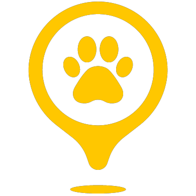
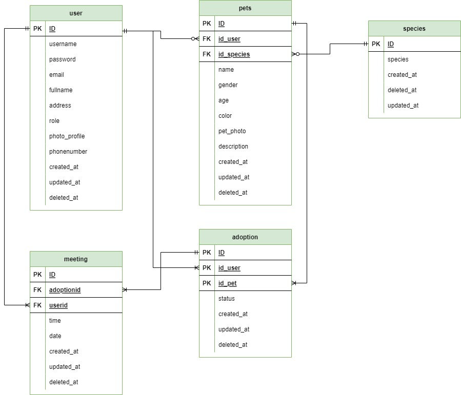

# 

Petdopter Application created with Golang Echo, OAuth, Google Calender and Google Cloud
<div align="center">
  <a href="https://github.com/ProjectCapstone-PetAdopter/PetAdopter-Backend">
    
  </a>

  <h3 align="center">Pet-Adopt</h3>

  <p align="center">
     A place where you can find your favorite pets!
    <br />
    <a href="https://github.com/ProjectCapstone-PetAdopter/PetAdopter-Backend"><strong>Link Projects »</strong></a>
    <br />
  </p>
</div>


## 📜 Table of contents


* [General info](#ℹ️-general-info)
* [Technologies](#%EF%B8%8F-technologies)
* [ERD](#-erd)
* [Prototype](#-prototype)
* [Demo](#-demo)
* [Packages](#-packages)
* [Installation](#%EF%B8%8F-installation)
* [Contributors](#-contributors)
## ℹ️ General info

Nowadays, human concern for stray pets is increasing, so there is a need for a platform that accommodates the adoption process.

## 🛠️ Technologies

- [Golang](https://go.dev)
- [Echo (Golang Framework)](https://echo.labstack.com)
- [Draw.io](/readme/erd.png)
- [Swagger](https://app.swaggerhub.com/apis-docs/Capstone-tim1/PetAdopter-tim1/1.0.0)
- [Google OAuth](https://google.com)
- [Google Calender](https://google.com)
- [Google Cloud](https://google.com)
- [Docker](https://www.docker.com/get-started)
- [Ubuntu](https://ubuntu.com/download)

[forks-shield]: 	https://img.shields.io/github/forks/ProjectCapstone-PetAdopter/PetAdopter-Backend

[Forks-url]: https://google.com
[Stars-url]: https://google.com

[Stars-shield]: 	https://img.shields.io/github/stars/ProjectCapstone-PetAdopter/PetAdopter-Backend

## 📱 ERD

<p align="center">

</p>


## 📱 Prototype

<p align="center">

</p>

You can find the open api design here
[Swagger Open API](https://app.swaggerhub.com/apis-docs/Capstone-tim1/PetAdopter-tim1/1.0.0)

## 🌐 Demo

- [Live](https://golangprojectku.site/)


## 📦 Packages

- [![Echo]][Echo-url]
- [![OAuth]][OAuth-url]
- [![Calender]][Calender-url]
- [![Google Cloud]][cgp-url]

## ⚙️ Installation

- Clone this project

```bash
  git clone https://github.com/ProjectCapstone-PetAdopter/PetAdopter-Backend.git
```
- Run project
```bash
  cd PetAdopter-Backend

  go get

  go run main.go
```
## 🧑‍💻 Contributors

The following is a list of contributors to this project

[Lukman Hafidz](https://github.com/lukmanhafidz) - [Rizuna Diva](https://github.com/rizunadiva) - [Ahmad Reski](https://github.com/reski-id)


[forks-shield]: 	https://img.shields.io/github/forks/ProjectCapstone-PetAdopter/PetAdopter-Backend

[Forks-url]: https://google.com
[Stars-url]: https://google.com

[Stars-shield]: 	https://img.shields.io/github/stars/ProjectCapstone-PetAdopter/PetAdopter-Backend

[Golang]: https://img.shields.io/badge/Golang-Golang-9cf
[Golang-url]: https://go.dev/

[Echo]: https://img.shields.io/badge/Golang-Echo-9cf
[Echo-url]: https://echo.labstack.com/

[Swagger]: https://img.shields.io/badge/SwaggerHub-OpenApi-success
[Swagger-url]: https://app.swaggerhub.com/apis-docs/Capstone-tim1/PetAdopter-tim1/1.0.0

[Draw.io]: https://img.shields.io/badge/Draw.io-ERD-red
[Draw-url]: /readme/erd.png

[OAuth]: https://img.shields.io/badge/OAuth-Google-informational
[OAuth-url]: https://developers.google.com/identity/protocols/oauth2

[Calender]: https://img.shields.io/badge/Calender-Google-blue
[Calender-url]: https://calendar.google.com/calendar/u/0/r?pli=1

[Google Cloud]: https://img.shields.io/badge/Google%20Cloud-Google-informational
[cgp-url]: https://cloud.google.com

[Docker]: https://img.shields.io/badge/Virtualization-Docker-blue
[Docker-url]: https://www.docker.com/get-started/

[Ubuntu]: https://img.shields.io/badge/Linux-Ubuntu-critical
[Ubuntu-url]: https://ubuntu.com/download
