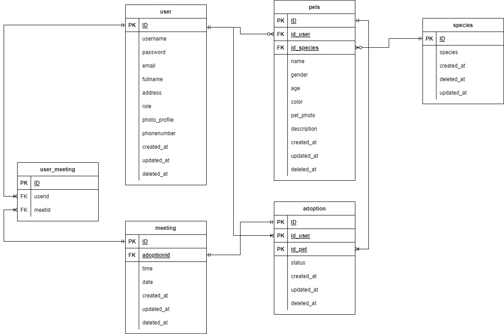
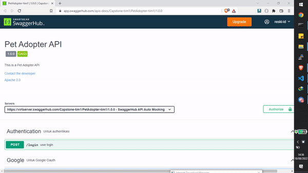

<div id="top"></div>


<!-- PROJECT SHIELDS -->
<!--
*** https://www.markdownguide.org/basic-syntax/#reference-style-links
-->
[![Forks][forks-shield]][Forks-url]
[![Stars][Stars-shield]][Stars-url]


<!-- PROJECT LOGO -->
<br />
<div align="center">
  <a href="https://github.com/othneildrew/Pet-Adopt">
    
  </a>

  <h3 align="center">Pet-Adopt</h3>

  <p align="center">
    A place where you can find your favorite pets!
    <br />
    <a href="https://github.com/ProjectCapstone-PetAdopter/PetAdopter-Backend"><strong>Link Projects »</strong></a>
    <br />
  </p>
</div>


<!-- TABLE OF CONTENTS -->
<details>
  <summary>Table of Contents</summary>
  <ol>
    <li>
      <a href="#about-the-project">About The Project</a>
      <ul>
        <li><a href="#built-with">Built With</a></li>
      </ul>
    </li>
    <li>
      <a href="#getting-started">Getting Started</a>
      <ul>
        <li><a href="#prerequisites">Prerequisites</a></li>
      </ul>
    </li>
    <li><a href="#erd">ERD</a></li>
    <li><a href="#open-api">Open Api</a></li>
    <li><a href="#contributor">Contributor</a></li>
  </ol>
</details>


<!-- ABOUT THE PROJECT -->
## About The Project

[![Product Name Screen Shot][product-screenshot]](https://example.com)

This program allows everyone to find and raise their favorite animals

this is how:
* Users can register, then search for available animals for adoption
* The previous pet owner will approve the adoption request, and make an appointment in person
* After meeting the previous animal owner, now the user can adopt their favorite animal :smile:

<p align="right">(<a href="#top">back to top</a>)</p>


### Built With

This project was built using the Clean Architecture Concept with the Golang echo framework.

The following is a list of the technologies we used in this project :

* [![Golang]][Golang-url]
* [![Echo]][Echo-url]
* [![Swagger]][Swagger-url]
* [![Draw.io]][Draw-url]
* [![OAuth]][OAuth-url]
* [![Calender]][Calender-url]
* [![Google Cloud]][cgp-url]


<!-- GETTING STARTED -->
## Getting Started
In terms of using this program make sure to follow the steps below

Make sure your computer has golang installed.

1. If you don't have Golang on your computer, you can download it at [https://go.dev/doc/install](https://go.dev/doc/install)

2. Clone the repo
   ```sh
   git clone https://github.com/ProjectCapstone-PetAdopter/PetAdopter-Backend.git
   ```

3. Install All Dependency
   ```sh
   go get
   ```

3. set environment, database connection
   ```sh
   .env
   ```

4. Run Projects
   ```js
   go run main.go
   ```

<p align="right">(<a href="#top">back to top</a>)</p>

<!-- ROADMAP -->
## ERD


<p align="right">(<a href="#top">back to top</a>)</p>

## Open Api


[Swagger Open Api link](https://app.swaggerhub.com/apis-docs/Capstone-tim1/PetAdopter-tim1/1.0.0)

 


<p align="right">(<a href="#top">back to top</a>)</p>

<!-- CONTRIBUTING -->
## Contributor


The following is a list of contributors to this project

[Lukman Hafidz](https://github.com/lukmanhafidz) - [Rizuna diva](https://github.com/rizunadiva) - [Ahmad Reski](https://github.com/reski-id)


<p align="right">(<a href="#top">back to top</a>)</p>


<!-- MARKDOWN LINKS & IMAGES -->
<!-- https://www.markdownguide.org/basic-syntax/#reference-style-links -->

[forks-shield]: 	https://img.shields.io/github/forks/ProjectCapstone-PetAdopter/PetAdopter-Backend

[Forks-url]: https://google.com
[Stars-url]: https://google.com

[Stars-shield]: 	https://img.shields.io/github/stars/ProjectCapstone-PetAdopter/PetAdopter-Backend

[Golang]: https://img.shields.io/badge/Golang-Golang-9cf
[Golang-url]: https://go.dev/

[Echo]: https://img.shields.io/badge/Golang-Echo-9cf
[Echo-url]: https://echo.labstack.com/

[Swagger]: https://img.shields.io/badge/SwaggerHub-OpenApi-success
[Swagger-url]: https://app.swaggerhub.com/apis-docs/Capstone-tim1/PetAdopter-tim1/1.0.0

[Draw.io]: https://img.shields.io/badge/Draw.io-ERD-red
[Draw-url]: https://github.com/ProjectCapstone-PetAdopter/PetAdopter-Backend/tree/readme#erd

[OAuth]: https://img.shields.io/badge/OAuth-Google-informational
[OAuth-url]: https://google.com

[Calender]: https://img.shields.io/badge/Calender-Google-blue
[Calender-url]: https://google.com

[Google Cloud]: https://img.shields.io/badge/Google%20Cloud-Google-informational
[cgp-url]: https://google.com
